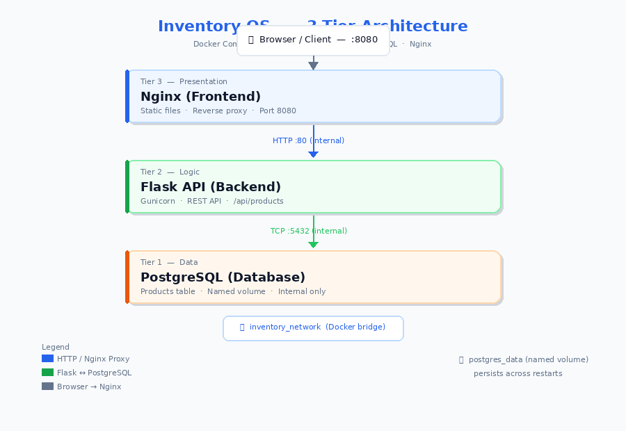
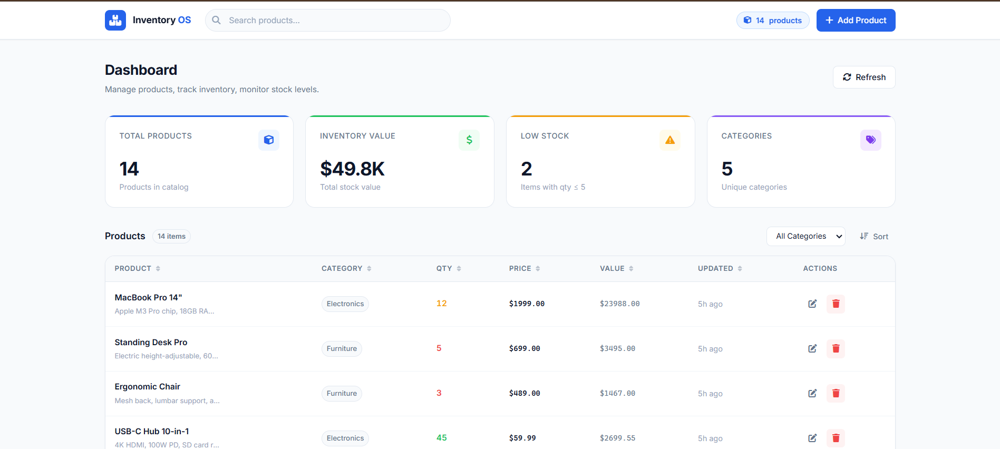

# 📦 Inventory OS — Production-Ready 3-Tier Inventory Management System

A full-stack, Dockerized inventory management system built with **Python Flask**, **PostgreSQL**, and **Nginx**. Designed as a portfolio-grade project demonstrating real-world DevOps, backend, and frontend skills.



---

## ✨ Features

- **Full CRUD** — Create, read, update, and delete products via a clean REST API
- **Beautiful Dashboard** — SaaS-quality UI with stats cards, sortable table, pagination, and search
- **Real-time Stats** — Total products, inventory value, low-stock alerts, category count
- **3-Tier Architecture** — Nginx → Flask → PostgreSQL, each in its own Docker container
- **Health Checks** — Every container has health checks; services start in the right order
- **Persistent Storage** — PostgreSQL data survives container restarts via Docker named volumes
- **Sample Data** — 15 seed products loaded automatically on first run
- **Production Patterns** — Gunicorn WSGI server, structured logging, graceful error handling, env vars

---

## 🏗️ Architecture

```
┌─────────────────────────────────────────────────────────┐
│                      Browser / Client                    │
└───────────────────────────┬─────────────────────────────┘
                            │ HTTP :8080
┌───────────────────────────▼─────────────────────────────┐
│              Nginx (Frontend Container)                  │
│  • Serves static HTML / CSS / JS                        │
│  • Proxies /api/* → Flask backend                       │
└───────────────────────────┬─────────────────────────────┘
                            │ HTTP :5000 (internal)
┌───────────────────────────▼─────────────────────────────┐
│              Flask API (Backend Container)               │
│  • REST endpoints: /api/products                        │
│  • /health  /metrics                                    │
│  • Gunicorn WSGI server, 2 workers                      │
└───────────────────────────┬─────────────────────────────┘
                            │ TCP :5432 (internal)
┌───────────────────────────▼─────────────────────────────┐
│              PostgreSQL (Database Container)             │
│  • products table with indexes                          │
│  • Named Docker volume for persistence                  │
└─────────────────────────────────────────────────────────┘
```

All three containers share an internal Docker bridge network (`inventory_network`).  
Only **port 8080** is exposed to your host machine.

---

## 📁 Project Structure

```
python-3tier-app/
│
├── frontend/
│   ├── index.html       # Dashboard UI
│   ├── style.css        # Design system & component styles
│   ├── app.js           # API calls, state management, rendering
│   ├── nginx.conf       # Nginx config with API proxy
│   └── Dockerfile       # Nginx container image
│
├── backend/
│   ├── app.py           # Flask app factory, health/metrics endpoints
│   ├── config.py        # Centralized config (reads env vars)
│   ├── models.py        # SQLAlchemy Product model
│   ├── routes.py        # REST API routes (/api/products)
│   ├── requirements.txt # Python dependencies
│   ├── Dockerfile       # Flask container image
│   └── .dockerignore
│
├── database/
│   └── init.sql         # Schema + seed data (runs on first startup)
│
├── docker-compose.yml   # Orchestrates all 3 containers
├── .env.example         # Environment variable template
├── .gitignore
└── README.md
```

---

## 🚀 Quick Start

### Prerequisites
- [Docker](https://docs.docker.com/get-docker/) ≥ 24
- [Docker Compose](https://docs.docker.com/compose/) ≥ v2

### Run with Docker (recommended)

```bash
# 1. Clone the repository
git clone <your-repo-url>
cd python-3tier-app

# 2. (Optional) Create a .env file
cp .env.example .env

# 3. Build and start all containers
docker compose up --build

# 4. Open the app in your browser
open http://localhost:8080
```

The first `docker compose up --build` takes ~2 minutes (downloading base images, building).  
Subsequent starts are much faster.

---

## 🐳 Docker Commands

```bash
# Start in background (detached mode)
docker compose up --build -d

# View live logs from all containers
docker compose logs -f

# View logs from one container
docker compose logs -f backend

# Stop all containers (preserves data)
docker compose down

# Stop and DELETE all data volumes
docker compose down -v

# Rebuild a single container after code changes
docker compose up --build backend

# Run a shell inside the backend container
docker exec -it inventory_backend bash

# Connect to PostgreSQL directly
docker exec -it inventory_db psql -U inventory_user -d inventory_db
```

---

## 🔌 API Documentation

Base URL: `http://localhost:8080` (proxied through Nginx)

### Health Check
```
GET /health
```
```json
{ "status": "healthy" }
```

### Metrics
```
GET /metrics
```
```json
{
  "success": true,
  "data": {
    "total_products": 15,
    "database_status": "connected",
    "uptime_seconds": 42.5
  }
}
```

### Products

| Method | Endpoint | Description |
|--------|----------|-------------|
| GET    | `/api/products` | List all products |
| POST   | `/api/products` | Create a new product |
| GET    | `/api/products/:id` | Get a single product |
| PUT    | `/api/products/:id` | Update a product |
| DELETE | `/api/products/:id` | Delete a product |

**Product object:**
```json
{
  "id": 1,
  "name": "MacBook Pro 14\"",
  "description": "Apple M3 Pro chip",
  "category": "Electronics",
  "quantity": 12,
  "price": 1999.00,
  "created_at": "2024-01-15T10:30:00",
  "updated_at": "2024-01-15T10:30:00"
}
```

---

## 🧪 API Test Commands (curl)

```bash
# Health check
curl http://localhost:8080/health

# Metrics
curl http://localhost:8080/metrics | python3 -m json.tool

# List all products
curl http://localhost:8080/api/products | python3 -m json.tool

# Create a product
curl -X POST http://localhost:8080/api/products \
  -H "Content-Type: application/json" \
  -d '{
    "name": "Test Product",
    "description": "A test item",
    "category": "Testing",
    "quantity": 100,
    "price": 9.99
  }'

# Get a product by ID
curl http://localhost:8080/api/products/1

# Update a product
curl -X PUT http://localhost:8080/api/products/1 \
  -H "Content-Type: application/json" \
  -d '{"quantity": 50, "price": 1899.00}'

# Delete a product
curl -X DELETE http://localhost:8080/api/products/1
```

---

## 🛠️ Troubleshooting

**Port 8080 is already in use:**
```bash
# Change the port in .env
FRONTEND_PORT=8090
docker compose up --build
```

**Backend fails to connect to database:**
```bash
# Check if the database container is healthy
docker compose ps

# View database startup logs
docker compose logs database
```

**Database changes not taking effect:**
```bash
# The init.sql only runs on FIRST startup.
# To re-run it, delete the volume:
docker compose down -v
docker compose up --build
```

**Reset everything cleanly:**
```bash
docker compose down -v --remove-orphans
docker system prune -f
docker compose up --build
```

---

## 🔮 Future Improvements

- [ ] JWT authentication & user management
- [ ] Product image upload (S3 / MinIO)
- [ ] Export to CSV / PDF
- [ ] Audit log (who changed what, when)
- [ ] Low-stock email alerts
- [ ] Kubernetes deployment manifests (Deployment, Service, Ingress)
- [ ] Terraform IaC for AWS deployment (ECS + RDS)
- [ ] CI/CD pipeline (GitHub Actions)
- [ ] Unit & integration tests (pytest)
- [ ] Redis cache for API responses

---

## 📚 DevOps Concepts Demonstrated

| Concept | How it's used |
|---------|--------------|
| **Containerization** | Each tier runs in its own Docker container |
| **Container Orchestration** | Docker Compose manages the full stack |
| **Service Discovery** | Containers communicate by service name (e.g., `database:5432`) |
| **Health Checks** | All containers have health checks; `depends_on` uses them |
| **Data Persistence** | Named Docker volume survives container restarts |
| **Environment Variables** | All secrets and config via env vars, not hardcoded |
| **Reverse Proxy** | Nginx proxies API calls to Flask, hides internal topology |
| **Production WSGI** | Gunicorn serves Flask (not the dev server) |
| **Restart Policies** | `unless-stopped` restarts containers after failures |
| **Multi-stage Builds** | (Extension point) Separate build and runtime stages |
| **Internal Networking** | DB and backend not exposed to host; only frontend is |
| **Init Containers** | `init.sql` seeds database schema on first run |

---

## 📸 Screenshots



---

## 📄 License

MIT License — free to use for portfolio, learning, or commercial projects...

//pipeline-test